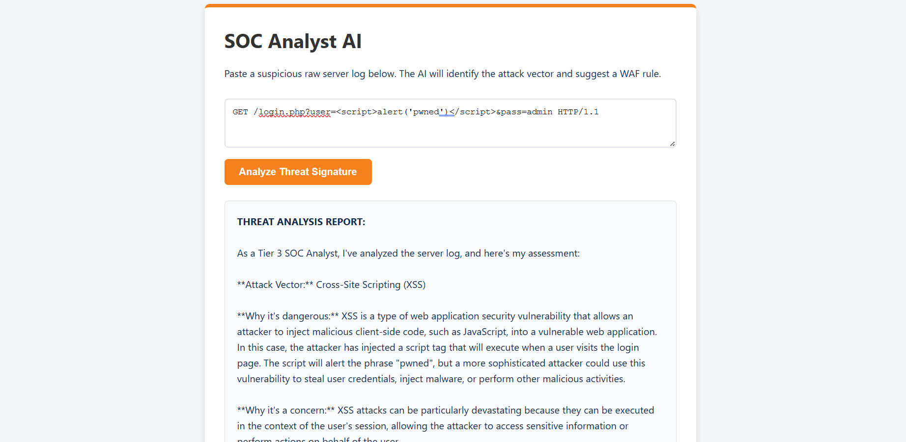

# SOC Analyst AI

An AI-powered security tool that analyzes logs to identify attack vectors and suggests remediation.

## Architecture
- **Frontend:** Cloudflare Pages (HTML/JS)
- **Backend:** Cloudflare Workers
- **AI Model:** @cf/meta/llama-3-8b-instruct (Workers AI)
- **State/Memory:** Cloudflare Workers KV (Stores audit history of analyzed logs)

## Usage
1. Paste a raw log line into the interface.
2. The system prompts Llama-3 acting as a SOC Analyst.
3. The AI identifies the threat and writes a WAF rule suggestion.
